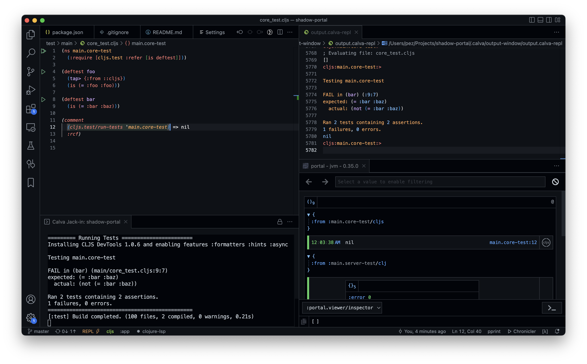

# Template project for Portal with shadow-cljs

This project contains a [Clojure](https://clojure.org) ”server” ([src/main/server.clj](src/main/server.clj)) and a [ClojureScript](https://clojurescript.org) frontend, managed by [shadow-cljs](https://shadow-cljs.github.io/). The project is also configured to automatically give you [Portal](https://github.com/djblue/portal) help with navigating data.

As of this writing, [Calva](https://calva.io) is assumed. Let's hope we can see config added for other Clojure development environments too. PRs welcome!

## How to use

0. `npm i`

With Calva and the Portal VS Code extension installed:

1. Open the project in VS Code
2. Run: **Calva: Start Project REPL and Connect (aka Jack-in)**
    1. Select the project type: **shadow-portal**

The REPL should start and the Portal webview should appear.

## Works

There are taps in [test/main/server_test.clj](test/main/server_test.clj) and [test/main/core_test.cljs](test/main/core_test.cljs). Run the tests in the REPL and see the taps in Portal.

The project is configured to use [Portal nREPL middleware](https://cljdoc.org/d/djblue/portal/0.35.0/doc/guides/nrepl). Which makes all evaluation results go to Portal. With the benefits mentioned at the Portal docs page just linked. This is configured in [shadow-cljs.edn](shadow-cljs.edn).

The project is configured to use dependencies from [deps.edn](deps.edn). There's a commented config in [shadow-cljs.edn](shadow-cljs.edn) that lets you use the also provided [Leiningen](https://leiningen.org/) project file, [project.clj](project.clj).

**NB**: The nREPL middleware will not send `stdout` to Portal. This is probably by designed so not listed in [Doesn't work](#doesnt-work) below.

## Doesn't work

The taps for [test/main/core_test.cljs](test/main/core_test.cljs) doesn't happen for the `:test` shadow-cljs build, which runs the tests every time shadow reloads code. @djblue and I are looking at this. We intend to make it work.

## Portal setup code

The code for starting Portal and open the webview is in [env/dev/portal/setup.clj](env/dev/portal/setup.clj), this is started as part of the REPL connection from [.vscode/settings.json](.vscode/settings.json)

The code for adding the ClojureScript tap is in [env/dev/portal/setup.cljs](env/dev/portal/setup.cljs). It is loaded by shadow-cljs from [shadow-cljs.edn](shadow-cljs.edn). (Where it is configured both for the `:app` and the `:test` builds.)
